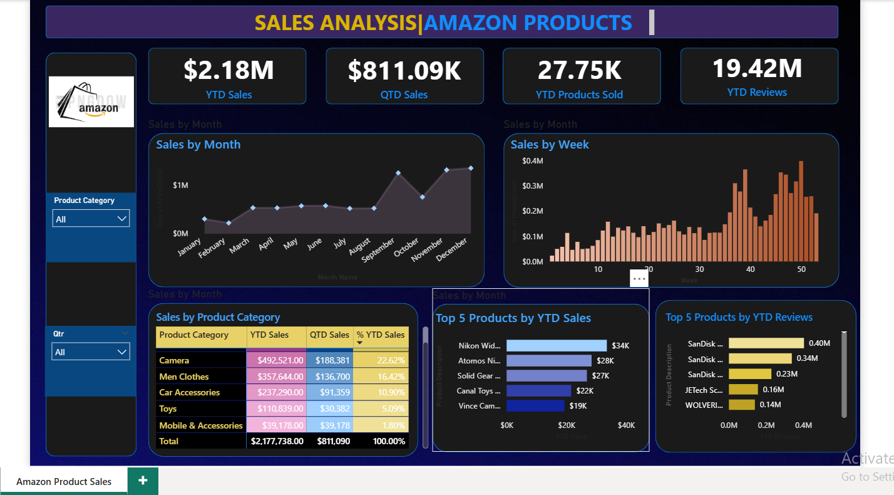

# 📊 Amazon Sales Analysis Dashboard using Power BI

This project presents a comprehensive sales analysis of Amazon products using an interactive Power BI dashboard. It is designed to help visualize product performance, review trends, and category-wise breakdowns.

---

## ✨ 1. Project Purpose / Description

The goal of this project is to analyze Year-to-Date (YTD) and Quarter-to-Date (QTD) Amazon sales data across various product categories using Power BI.  
It enables business users and analysts to easily identify trends, high-performing products, and customer behavior insights.

---

## 🛠 2. Tech Stack Used

- **Power BI** – For building the interactive dashboard and data modeling  
- **Microsoft Excel** – For storing and cleaning the sales dataset  
- **GitHub** – For sharing and version control of the project files

---

## 📁 3. Data Source

The dataset used is available in the file `Amazon_Combined_Data.xlsx`.  
It includes:
- Product Categories  
- YTD & QTD Sales Figures  
- Weekly and Monthly Sales Data  
- Customer Review Counts  
- Product Names and Descriptions

---

## 🌟 4. Key Features / Highlights

- 📌 Track YTD and QTD Sales Metrics  
- 📊 Monthly and Weekly Sales Trend Visualizations  
- 🛍️ Sales Breakdown by Product Category  
- 🏆 Top 5 Products by Sales and Reviews  
- 🔍 Interactive Filters for Product Category and Quarter

---

## 🖼️ 5. Screenshot Demo

Here is a preview of the Power BI dashboard created in this project:

---

## 🚀 6. How to Use

1. **Clone or download** this repository to your local machine  
2. Open the file `Amazon_Sales_Data.pbix` using **Power BI Desktop**  
3. Explore and interact with the dashboard  
4. Optionally, modify visuals and filters based on your analysis needs

---

## 🙌 Acknowledgements

This project was created as a part of a Power BI learning exercise.

**Created by [Pooja](https://github.com/Pooja4121996)**  
Feel free to explore, star ⭐ the repo, or share your feedback!

